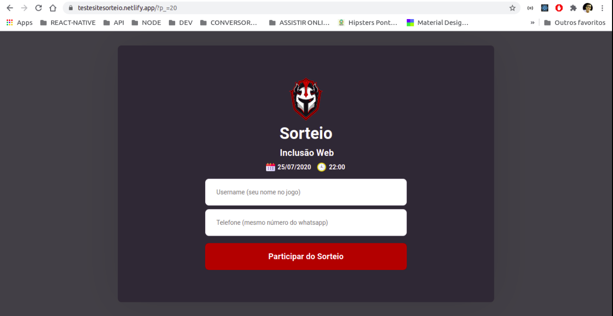
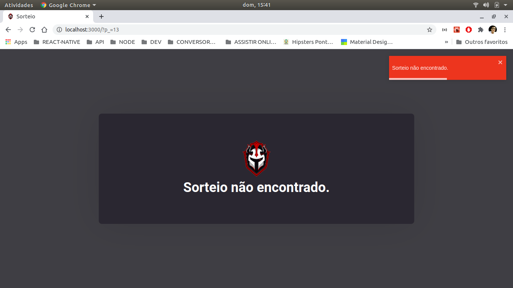

<h2 align="center">
Guild Raffle

 Página para cadastro de sorteios

</h2>

Uma página web que realiza o cadastro de usuários no sorteio da guilda **Revolution** no jogo **Rise of Kindoms** (play store).
O sorteio será gerencado pelo app mobile, a página é destinada para os jogadores que possuem celulares com sistema operaconal ios, portando o layout está responsivo para dispositivos mobile.

### Ferramentas utilizadas:
- ReactJS;
- Axios (requisições);
- React Router Dom (gerenciar rotas);
- Remask (máscaras para input);
- React Toastify (toast);
-  Styled Loaders React (animação loading);

### Funcionalidades :
##### 1.  Cadastro de sorteio
- Permite que o usuário se cadastre informando seu `username` no jogo e seu `número` do whatsapp.

- O número do sorteio deve ser informado pelo parâmetro `p_` na url.
-Ex: `www.meusite.com/?p_=numero_sorteio`

### Condições para participar:
- O sorteio deve existir;
- O sorteio deve ter status `A`;
- O usuário não deve ter se cadastrado pelo app mobile;
- O usuário não deve já está participando do sorteio;

### Telas:

---

## Licença

Esse projeto está sob a licença MIT. Veja o arquivo [LICENSE](LICENSE) para mais detalhes.
